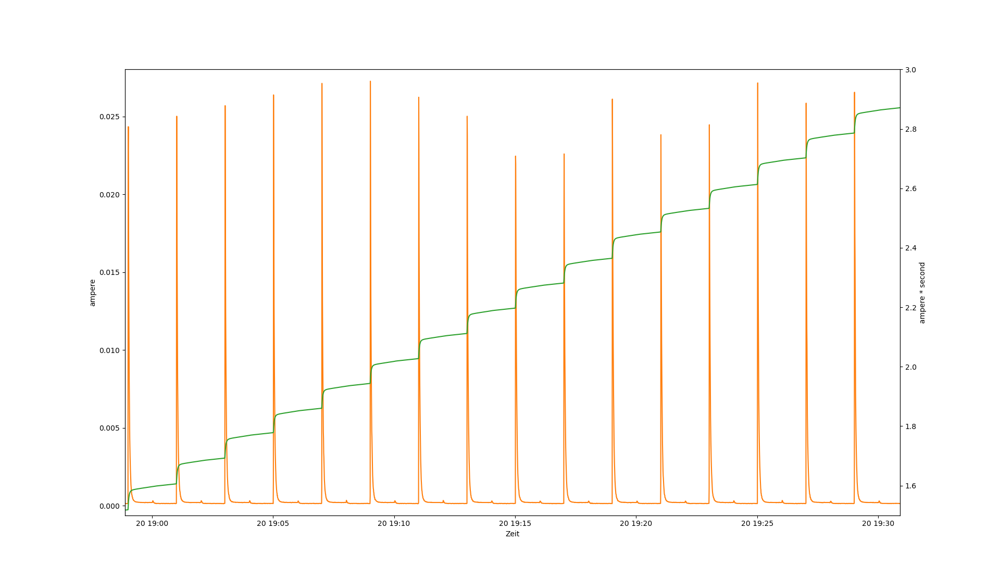

# Master Clock

Note: Most of the documentation is written in English. But there is a short
German summary at the beginning.

## Summary (German)

Ziel des Projektes ist die Ansteuerung von Neben- beziehungsweise Tochteruhren ohne
zugehörige Mutteruhr. Als Energiequelle sollen Batterien verwendet werden.

Die Art von Nebenuhren, um die es hier geht, wurde z.B. häufig in Fabrikhallen
eingesetzt. Sehr häufig findet man sie z.B. mit Aufdruck von Siemens oder
ähnlichen Firmen. Die Nebenuhren sind so gebaut, dass der Minutenzeiger mit
einem Impuls um jeweils eine Minute weiterspringt. Dabei muss abwechselnd ein
positiver und ein negativer Spannungsimpuls angelegt werden. Üblicherweise
werden Uhren mit ±12 V oder ±24 V betrieben. Es scheint auch vereinzelte Modelle
mit höheren Spannungen zu geben.

Die Funktionsweise der Uhren wird von
[Rolf Süßbrich in einem ähnlichen Projekt](http://www.suessbrich.info/elek/ErsatzMutteruhr.html)
([archivierte Version](https://web.archive.org/web/20211020055925/http://www.suessbrich.info/elek/ErsatzMutteruhr.html))
gut erklärt. Die dort verwendete Schaltungsidee diente auch mir als Grundlage.
Allerdings habe ich zur Erzeugung des Minutenimpulses ein Mikrocontroller
eingesetzt, da dieser die Aufgabe stromsparender erledigen sollte, als
klassische CMOS-Bausteine. Statt am Eingang mit 10 Batterien für die 12V zu
arbeiten, wurde ein kleiner Step-Up-Regler aufgebaut, der auch für 24V Uhren
geeignet ist. Bei der Endstufe wurde die Idee aufgegriffen, einen
Operationsverstärker zur Ansteuerung zu verwenden.

### Useage (German)

Am Eingang der Platine kann eine Spannung von ca. 3 bis 10 V angelegt werden.
Höhere Spannungen führen dabei voraussichtlich zu niedrigeren Strömen beim
Schaltreglerteil. Der Prozessor wird über einen Linearregler versorgt und hat
daher einen konstante Stromaufnahme (und damit eine steigende Energieaufnahme
bei steigender Spannung). Der Schaltreglerteil sollte allerdings beim
Energiebudget überwiegen.

Am Ausgang wird der Motor der Uhr angeschlossen. Die Polarität ist dabei nicht
relevant.

Je nach Uhrwerk kann es sein, dass der Ausgangskondensator (C5) eventuell etwas
größer oder kleiner dimensioniert werden kann. Er sollte jedoch immer kleiner
als C4 sein. Kleinere Kondensatoren führen zu einer geringeren Stromaufnahme und
damit zu einer längeren Batterielebensdauer. Größere Kondensatoren liefern mehr
Energie für jeden Schritt des Zeigers.

Die Tasten werden einmal pro Sekunde ausgewertet, müssen also etwas länger
gedrückt werden. Die beiden Tasten haben folgende Funktionen:

PAUSE: Setzt die Minutensprünge aus. Während der Pausenzeit blinkt die LED jede
Sekunde kurz auf um den Zustand anzuzeigen. Kann mit STEP fortgesetzt
werden.

STEP: Wird die Taste mindestens eine Sekunde lang gedrückt, wird nach 5 Sekunden
ein Minutensprung ausgelöst. Ab diesem Zeitpunkt wird dann die nächste Minute
gezählt. Die 5 Sekunden sind notwendig, um dem Ausgangskondensator genügend Zeit
zum Laden zu geben. Ein erkannter Tastendruck wird mit einem kurzen Blinken der
LED bestätigt.

Beim Einlegen der Batterien oder manuellem Verstellen der Zeiger kann es
vorkommen, dass der erste Sprung ausbleibt. Das hängt von der Position des
Motors ab.

## Summary

The aim of the project is to control so called slave clocks without an
associated master clock. Batteries are to be used as the energy source.

The type of slave clocks in question were often used for example in factory
halls. They are very often found with the imprint of Siemens or similar
companies. The slave clocks are designed so that the minute hand advances by one
minute at a time with each electric pulse. A positive and a negative voltage
pulse must be applied alternately. Clocks are usually operated with ±12 V or ±24
V. There also appear to be a few models with higher voltages.

The operation of the clocks is well explained in German by
[Rolf Süßbrich in a similar project](http://www.suessbrich.info/elek/ErsatzMutteruhr.html)
([archived Version](https://web.archive.org/web/20211020055925/http://www.suessbrich.info/elek/ErsatzMutteruhr.html)).
I used the same basic idea as that project. However, I used a microcontroller to
generate the minute pulse, as this should do the job more energy-efficiently
than classic CMOS components. Instead of working with 10 batteries for the 12 V
input, a small step-up regulator was built, which is also suitable for 24 V
clocks. For the output stage, the idea of using an operational amplifier was
taken up.

### Useage Instructions

A voltage of approx. 3 to 10 V can be applied to the input of the circuit board.
Higher voltages are likely to lead to lower currents in the switching regulator
section. The processor is supplied via a linear regulator and therefore has a
constant current consumption (and thus an increasing energy consumption with
increasing voltage). However, the switching regulator part should predominate in
the energy budget.

The motor of the clock is connected to the output. The polarity is not relevant.

Depending on the movement, the output capacitor (C5) may be slightly larger or
smaller. However, it should always be smaller than C4. Smaller capacitors result
in lower current consumption and therefore a longer battery life. Larger
capacitors supply more energy for each step of the minute hand.

The buttons are analysed once per second, so they must be pressed a little
longer than that. The two buttons have the following functions:

PAUSE: Pauses the minute jumps. During the pause time, the LED flashes briefly
every second to indicate the status. Can be continued with STEP.

STEP: If the button is pressed for at least one second, a minute jump is
triggered after 5 seconds. The next minute is then counted from this point. The
5 seconds are necessary to give the output capacitor enough time to charge. A
recognised button press is confirmed by the LED flashing briefly.

When inserting the batteries or manually adjusting the hands, the first jump may
not occur. This depends on the initial position of the motor.

## Long Story

This chapter contains a bit more details of the development process.

The whole story started with a visitor at our local Repair Cafe (a event where
people can bring broken stuff and where volunteers help with tools and knowledge
to repair the things). The visitor had two slave clocks that have been left over
after a renovation in his company and that he was allowed to take with him. This
type of clocks only work with a controller. So he wasn't able to use them.

The clocks picked my interest and therefore I analyzed them a bit more. I found
out that they need a alternating pulse of (in that case) ±24 V per Minute. I
promised that we will find a way to use the clocks but that it will need some
time.

After some research at home, I found out that the type of clocks are quite
common in bigger companies. There are controllers commercially available that
cost something around 100 Euro and usually need quite a bit of energy.

My first idea was to just put together some modules (step up converter, small
controller board, motor controller) and create a quick and dirty version of
these controllers. This not very optimized variant would have required a plug-in
power supply quite similar to the commercially available versions but would have
been only a fraction of the costs (around 15 to 20 Euro should be possible).

The big disadvantage was the plug-in power supply. The visitor would prefer, if
he could use batteries instead of that. That's why I threw this idea over board
and restarted from scratch. During my search for inspiration, I stumbled upon a
project from Rolf Süßbrich (see Summary for a link) that used a quite simple
approach. Instead of a full motor driver, this project generates a simple
rectangular signal with 0 V and +12 V levels. The trick to generate the negative
pulse is to connect a capacitor in series with the clock motor and drive the
positive side of the capacitor to +12 V or 0 V.

My problem with the circuit was: It uses a total of 10 batteries for the supply
to generate the 12 V. I have some experience with switching regulators so I
decided that it should be possible to do the same with a low power step up
converter.

### Simulation

I searched for some low power step-up converters. The LT8330 seemed to be a good
fit. So I started with a simulation. The first approach was to simulate the
complete circuit with a general purpose OPV (OP292) as the output driver. I
later replaced that OPV with a different one.

For the clock motor, I had a measurement of about 2 kOhm coil resistance and I
estimated the inductance to be something around 0.1 H based on the coil
geometry. That's a very rough estimate but it should be good enough for the
simulation.

So the first draft of the simulation looked like follows:

The simulation of the complete schematic took a long time (most part of a day
for a bit more than 200ms). So I split it up and simulated the DC/DC and OPV
part separately.

#### DC/DC part

For the DC/DC converter the following schematic has been used:

I added a source that integrates the used energy and displays it as an
equivalent voltage. 1 V equals to 1 Wh.

As a result of the simulation, the DC/DC converter should need about

    (1.31 µWh - 1.04 µWh) / (0.9 s - 0.2 s) = 0.39 µW

#### OPV and clock part

During the simulation of the OPV and clock part, I noted that the OP292 is not
an ideal candidate. Based on availability, existing simulation models (in
LTSpice) and datasheets, I decided to replace it with a LT1178 or a similar
OP193. Both are capable to drive a few mA on the output, can handle the voltage
range of 24V and have low quiescent currents.

So the following schematic has been simulated:

Which gave the following result:

That part of the schematic needs about 5 mWh in one hour so it's a consumption
of about 5 mW.

#### Battery estimate

Based on these numbers, I was able to estimate the necessary battery. The DC/DC
part can be neglected. So the main part are the 5 mW of the OPV + clock part.
According to Wikipedia, an AA alkaline battery should have a capacity between
1700 mAh and 2850 mAh. So as an estimate, 3000 mWh should be fine. With that,
the clock would work 3000 mWh / 5 mW = 600 hours = 25 days with a single cell.

Again according to Wikipedia, a C cell has up to 8000 mAh. So a single C cell
would reach for about 100 days. With three to four of that, a year should be
possible. That's good enough for the estimation.

### Real Hardware

The simulation results looked well enough. So I started to design a small
circuit board based on that using KiCAD. The schematic and layout can be found
in `Hardware/Master_Clock`. Outputs in PDF and Gerber files are available in
that folder too.

As a source for the minute pulse, I added a small ATTiny. The standby current at
1.8V is very low and even the operating current is tiny if the system is clocked
at 32kHz.

I wanted to be able to order the boards as cheap as possible. So I used a simple
2 layer technology. I decided to try Aisler for these simple boards. They came
out quite well and even with the Blitz service, they are reasonably priced.
Together with the parts, one board is about 27 Euro.

I haven't ordered a paste mask because I currently don't have a soldering oven.
So populating the boards is hand work.

<!-- FIXME: Add photo of assembled board -->

### Software

The software is really simple. It just initializes all necessary hardware and
then sleeps. It wakes up the controller every second (using the PIT) and
switches the minute output to the other level.

### Tests and Measurements

#### Estimate Influence of C5

The first tests with the circuit worked really well. It worked more or less out
of the box. So I did some current consumption measurements. It's not simple to
measure currents that small. The multimeter that I used (a Owon HDS2102S) is not
really up to the job. The minimum current range is 200 mA with a resolution of
10 µA. I can connect it to the PC and (with some python scripting) I can get
about three measurements per second. The input capacitance of my circuit should
help a bit with the slow sampling rate. But despite that, with that range and
sampling rate, only a rough estimate is possible.

I started with the 470 µF capacitor for C5 that I originally planned. I supplied
the circuit from a USB power supply. With that, I recorded the following current
(orange; left axis) and calculated the consumption in As (green; right axis).

As a rough estimate from that graph, 2.6 As per hour are consumed (1.6 As at
19:00 and 2.9 As at 19:30). That's about 13 Ws per hour or 3.6 mW. That matches
astonishing well with the simulation results.

A lot of energy is put into the charging of the capacitor C5, regardless whether
that energy is needed to move the clock hands or not. So I tried to reduce the
capacitor to 100 µF. The clock still works well. The consumption dropped quite a
bit (note the different scale on the right axis).

Again a rough estimate from that graph leads to about 1.1 As per hour (0.2 As at
9:00 and 0.73 at 9:30). That's about 5.5 Ws per hour or 1.5 mW. The idle current
of about 150 to 200 µA (depending on the level of the minute output) is now a
relevant part of that consumption.

With an even smaller capacitor of 47 µF, the clock hands can't move any more.
A 47 µF parallel to a 22 µF works. So the 100 µF is already the lower limit that
should be useable. Assuming that the capacitor will age over time, most likely a
150 µF to 220 µF is a better choice.

#### Detailed Analysis

Especially with smaller capacitors for C5, the standby current is quite
relevant. Therefore I decided to take a more detailed look at what is using the
energy. Time to use a better meter. So I switched to a bench top meter with 5.5
digits at 5 readings per second measuring speed or 4.5 digits at 20 or 123
readings per second.

I decided to use a 220 µF capacitor for C5, because that's most likely the one
I'll later use. Beneath that, I switched to a laboratory power supply.

With 5 V supply, the current peaks to over 20 mA which would mean that I have to
use the 200 mA range. In that range, the resolution of the meter isn't
satisfactory any more at higher reading rates. Luckily, the high currents are
used for charging the capacitors. So the switching regulator is involved. By
just increasing the voltage to 10 V, I can avoid the currents over 20 mA and
therefore stick to the smaller range.

A recording with the length of a few minutes is shown here:

At the first minute pulse at about 49s, 0.0029 As or 29 mWs have been used. At
the third minute pules at about 169s, 0.0253 As or 253 mWs have been used. So
it's about 6.72 Ws per hour or 1.87 mW. A bit less then I expected for the 220
µF based on the earlier measurements. But I changed some other parameters
(higher voltage, better meter) so it's not unreasonable.

So what is using the energy? Let's take a look at the separate parts of the
schematic.

#### Part 1: Controller and Peripherals

I need the controller and it's peripherals for all other measurements for
generating the minute pulse. So I decided to check that one first.

The CPU is clocked with the 32 kHz oscillator. I power the controller with 1.8 V.
At these frequency and supply, the data sheet gives a typical consumption of 7
µA when active or 1.7 µA when idle (rated at 2V). The buttons have static
pull-ups and the LED is connected so that the idle (off) level of the pin is
low. So that shouldn't need any energy (except for some leakage current in the
capacitors parallel to the buttons). The oscillator is rated for 0.65 µA at 3.3V
or 0.38 µA at 1.2V. Let's assume the higher current. The LDO has a idle current
of something between 1.5 and 2.5 µA with no load. It is rated for 500 mA max so
the processor and peripherals should be basically no load. So the total
consumption should be below 10 µA.

That leaves the LED which is connected directly to the input voltage with a 2.2
kΩ resistor. At 10 V it should need about (10 V - 2 V) / 2.2 kΩ = 3.6 mA when
on. The LED is switched on only for very short flashes of 1 ms per minute. The
current should average to 60 nA which is a lot less than the rest of the
controller.

So much for theory. Now some measurements: I removed R13. With that, the whole
switching regulator part is disconnected. I recorded a [few minutes of
measurements](./Measurements/current_10V_controller_and_peripherals.png) in the
2 mA range of my meter. As expected, there was a very low current most of the
time with a few peaks when the LED has been switched on. The LED pulses are a
bit too short. So the meter didn't capture them well. The graphics is not that
easy to evaluate in this case. So I switched to the statistics function of the
meter instead. The average current there is at 3.9 µA which is less than the 10
µA that I estimated and therefore it's a reasonable value for the controller.
The maximum value is at 0.91 mA. That's less than the LED needs. It's likely
that the capacitors on the board smoothed out the LED current a bit so it's
still a reasonable peak value.

In summary, the controller system behaves like expected.

#### Part 2: Step Up Regulator Without Load

The next part in the circuit is the step up regulator. It's possible that C4 or
the OPV U3 waste some energy. So I have to remove these for the next
measurement.

According to the data sheet, the LT8330 should need up to 10 µA in Sleep Mode
(not switching) or up to 1100 µA if it is in Active Mode (not switching). The
LT8330 will charge the output capacitor and then it should go into sleep mode as
long as the output voltage doesn't drop too far. Without a load, the capacitor
should keep the voltage for quite some time and therefore I would expect that
the LT8330 basically sleeps all the time.

The feedback network R2 and R4 will use some energy. The data sheet suggests
something in the range of 1 MΩ. During the design, I already decided that this
would use up to much energy and used a network with 10 MΩ and 750 kΩ instead.
The feedback pin current in in the range of 10 nA so that the network should
still work with an acceptable accuracy. Still, the network needs quite a bit of
current: I = 24 V / 10.75 MΩ = 2.2 µA. That's at 24 V. At the 10 V input, that
will be already about 6 µA.

So in summary, the input current should be around 16 µA at 10 V.

Again: Back to the measurement. R13 has to be assembled again. Unfortunately I
didn't plan to disconnect C4 or the OPV. So there is no simple resistor to
unsolder or a friendly trace that I could cut. Instead I have to unsolder C4 and
disconnect pin 7 of U3. Unfortunately, I soldered U3 too well so that I couldn't
just lift the pin. So I decided to cut off the trade right at the pin.

With that, the total supply current averaged to 16.3 µA, again with a few 1 mA
peaks of the LED. From part 1 I know that 3.9 µA are from the controller. So
the DC/DC converter needs about 12.4 µA. That matches well with the estimated
value.

#### Part 3: Buffer Capacitor C4

Now to one of the main suspects: The big buffer capacitor C4. During the initial
design, I neglected to check the leakage current of that capacitor. I just used
some default Panasonic capacitor with the part number ECA-1HM102B.

In the data sheet, the leakage current is given as I ≤ 0.01 CV or 3 µA after 2
minutes (whichever is greater). For my capacity, the CV value most likely is the
interesting one. C is the capacitance, V is the rated voltage. The formula is a
bit odd because usually Farad times Volt should give Coulomb and not Ampere. So
this is one of the formulas, where the manufacturer decided to skip the right
unit of the constant. The 0.01 should be 0.01 Hz. With that, I get the following
leakage current:

0.01 Hz * C * V = 0.01 Hz * 1000 µF * 50 V = 0.5 mA

At the 10 V rail, that would be even more (about 1.2 mA). That's huge compared
to all other parts that I had till now.

In a real world measurement, I only get 20 to 21 µA of the complete circuit
after a few minutes if C4 is connected again. Half of that is the base current
from Part 2, so the capacitor is a lot better then the data sheet tells. The big
risk here is, that the leakage current will increase quite heavily over time.

In theory, the big capacity of C4 might isn't even necessary. The motor of the
clock is a coil with a lot of windings and some series resistors. In my case, it
has about 4 kΩ. Even if I assume other clocks with a quarter of that, the
maximum current is 24 mA. Both OPVs that I selected can drive less than that
(LT1178 can sink or source 5 mA according to the datasheet summary; OP193
summary tells something about ±8 mA). The switching regulator should be well
capable of delivering up to 100 mA, so C4 shouldn't be necessary.

Result: C4 will be removed completely. A test with 3 V and 10 V input voltage
showed no problems with that at all.

#### Part 4: Operational Amplifier

Next part is the Operational Amplifier without a load. Only OP193 is analyzed.
That one works well so I haven't tested the alternative LT1178 at all.

For the test, only the clock is disconnected. With that the output capacitor C5
is open on one side and therefore shouldn't be relevant.

For the OP193, the data sheet lists a supply current of up to 30 µA per
amplifier at ±18 V supply voltage. I have a lower supply voltage of only 24 V
(which would be equivalent to a ±12 V supply voltage) and a chip variant with a
single amplifier. So my current should be below that.

Let's test that. From now on, the measurement has to check two situations: A low
and a high minute pulse. So I'll wait for a pulse, reset the average on the
meter, wait for about 30 to 50 seconds and check the reading.

For the one minute, that's 57.8 µA. For the other minute, it's 80.9 µA. I have
to reduce these values by the 12.4 µA of the controller and DC/DC regulator. But
these values are at the 10 V input. So the idle current is at least (57.8 -
12.4) * 10 V / 24 V = 19 µA for the one and 29 µA for the other minute. That's
in the expected range.

#### Analyzing the Amplifier Some More

Analog Devices provides a nice App Note
[AN-849](https://www.analog.com/media/en/technical-documentation/application-notes/AN-849.pdf),
why Op amps shouldn't be used as comparators like I did in my circuit. One Point
is that an Op amp might have an input protection circuit with some diodes, that
protects the input from a differential voltage higher than ± 0.6 V.

The Application note suggests to read the data sheet very carefully and check
for the following points:

- Low values of absolute maximum differential input voltage. The OP193 has a
  quite high value for that so that shouldn't be a problem.

- Graphs of bias current or input current vs. differential or common-mode
  voltage that show discontinuities or gross nonlinearity. The OP193 indeed has
  a Input Bias Current vs. Common-Mode Voltage that's quite heavily nonlinear.

- Evidence of phase-inversion. One evidence can be a limit of the common mode
  voltage. The OP193 indeed has a limit for that that is about 0.1 V above and
  1.5 V below the minimum or maximum supply voltage.

The alternative chip (LT1178) does look a bit better regarding that (especially
the second point). But it's most likely not ideal either.

Measurements on the negative input of OP193 shows a 15 mV jump if the positive
input is switched. That's not much but it's visible.

On the output, there is a rise time of 1.1 ms. But no sign of ringing. The same
is true for the fall time.

To avoid potential problems with the input, additional resistor are added at the
positive input:

- The MinPulse trace is cut and a 2.2 MΩ is used to close the trace again
- A 2.2 MΩ is connected to 1.8V on the OPV side of the MinPulse trace
- A 2.2 MΩ is connected to GND on the OPV side of the MinPulse trace

With these changes, the jump on the negative input is about 7 mV. It has an
absolute level of 610mW. The positive input is either 458 mV or 903 mV. The
current consumption is still (on the 10V side) at 58 µA in the one minute and 81
µA in the other minute.

#### Big Resistors

During measurements, I noted that the system is quite sensitive to touches. It's
very likely that the reason for this are the high values for some of the
resistors. To make the system more stable, I added the following changes:

* Reduce the divider R1 and R3 to two 2.2 MΩ instead of the 10 MΩ. This will
  increase the current on the 1.8V side (and due to the linear regulator) by
  only 0.3 µA and therefore isn't a problem.
* Change the divider for the LT8330 feedback voltage (R2 and R4). That one
  currently needs 2.4 µA. Alternative values are:
    * 4.7 MΩ and 330 kΩ. That will result in a voltage of 24.4 V.
    * 2.2 MΩ and 330 kΩ. That will result in a voltage of 12.3 V.

#### Things To Do

* There are some minor bugs especially in the marking of the first PCB. These
  are documented in a README in the project folder.
* The idle current is a lot higher than estimated. Find out why that is the
  case.
* Add photos.
